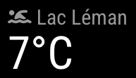

# MMM-AlplakesLiveTemperature

[MagicMirror²](https://github.com/MichMich/MagicMirror/) module to display live temperature of a given lake in the Alps (Switzerland, Italy, France, ...). 
Note that not all lakes are covered by the API provider.



## Installation

1. Navigate to the `MagicMirror/modules` directory.
2. Execute `git clone https://github.com/teemoo7/MMM-AlplakesLiveTemperature.git`
3. Run `npm install` in the `MagicMirror/modules/MMM-AlplakesLiveTemperature` directory
4. Configure the module with your settings as per below
5. Restart MagicMirror

## Update

1. Navigate to the `MagicMirror/modules/MMM-AlplakesLiveTemperature` directory.
2. Execute `git pull` to pull the latest version of the repository.
3. Run `npm install` to update dependencies if needed.

## Usage

To use this module, add the following configuration block to the modules array in the `config/config.js` file. 

You can either display the average temperature of the lake:
```js
modules: [
  {
    module: "MMM-AlplakesLiveTemperature",
    position: "top_left",
    config: {
      title: "Lac Léman",
      lake: "geneva",
    }
  },
]
```

Or the temperature at a specific point in the lake:
```js
modules: [
  {
    module: "MMM-AlplakesLiveTemperature",
    position: "top_left",
    config: {
      title: "Plage du Jardin Doret",
      lake: "geneva",
      latitude: 46.46172,
      longitude: 6.834985, 
      depth: 2
    }
  },
]
```

## Configuration

### Options

| Field            | Required | Description                                                           | Default                          |
|------------------|----------|-----------------------------------------------------------------------|----------------------------------|
| `title`          | `false`  | The title to be displayed (lake name or beach name, up to you)        | (empty)                          |
| `lake`           | `true`   | The lake name as defined by API provider Alplakes (see below)         |                                  |
| `depth `         | `false`  | The depth (in meters) at which temperature is to be retrieved         | `1`                              |
| `latitude `      | `false`  | Latitude coordinate of the location                                   | (empty)                          |
| `longitude`      | `false`  | The depth (in meters) at which temperature is to be retrieved         | (empty)                          |
| `refresh`        | `false`  | Refresh interval (in milliseconds)                                    | `(60 * 60 * 1000)` (1 hour)      |
| `animationSpeed` | `false`  | Animation time to display results (in milliseconds)                   | `2000`                           |
| `units`          | `false`  | Units for temperature. Values can be `metric` (°C) or `imperial` (°F) | Value from global config `units` |

## Alplakes API

Relies on [Alplakes API](https://www.alplakes.eawag.ch/).

Lake values include: `geneva`, `zurich`, `biel`, `joux`, `garda`, `lugano`, etc

